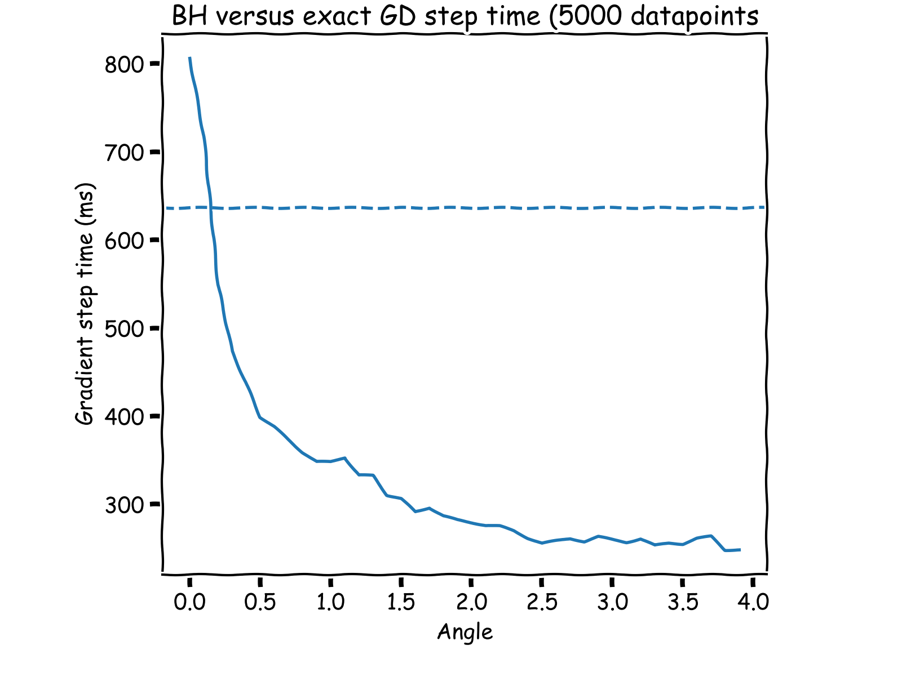
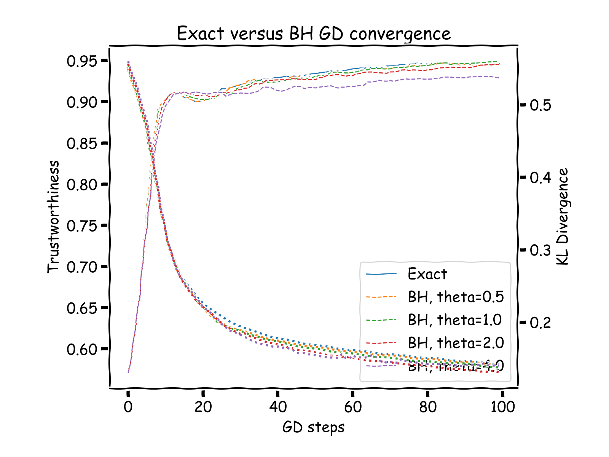
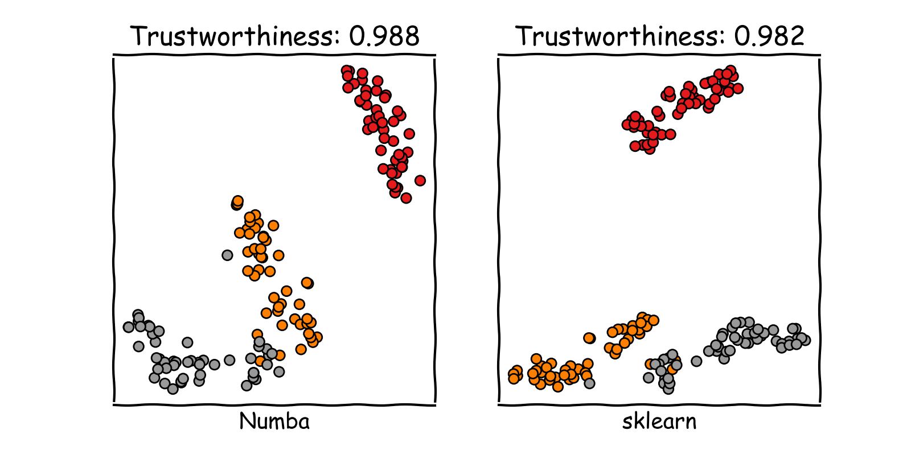
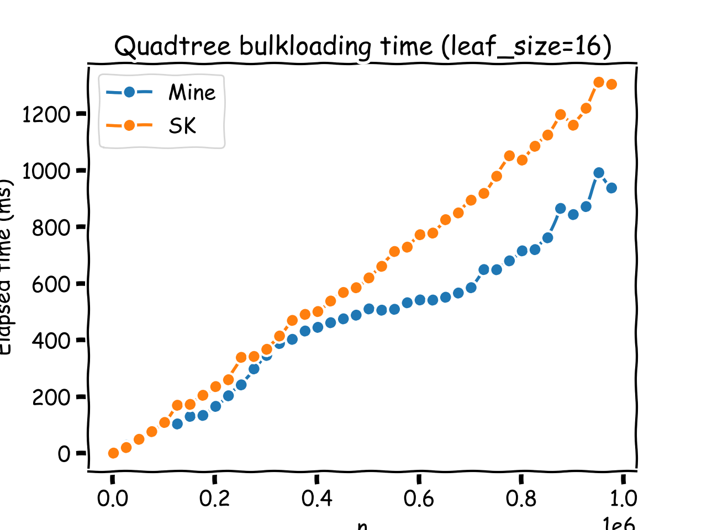

# TSNE
Numba implementation of the t-Stochastic Neighbors Embedding.

## Implementation details
This repo follows optimization schemes described by the original author [here](https://arxiv.org/pdf/1301.3342.pdf).
### Compute pairwise similarity matrices
On input data, this scheme is Quadratic. To curb that, the pairwise similarity scores are only computed on the k nearest neighbors of each input points.
NB: this speed up is challenged when input data dimensionality becomes "big", ie. 64 or bigger (tested for 5,000 points)
### Compute Kullback-Leibler gradients
On embedded data, a QuadTree is built and then queried following a depth-first search: for each quad cell which is sufficiently far from the point of interest and sufficiently compact, the sum of the repulsive force exerced by all the points inside that cells are summed up to an approximation of the force exerced by the cell centroid.  
The Barnes Hut process is nicely explained [here](https://jheer.github.io/barnes-hut/).

  

  <figcaption>Gradient step time comparison (input data 5,000x3). Horizontal line is the exact KL gradient computation. Angle is the approximation parameter, trading gradient precision for speed</figcaption>

  

  <figcaption>Convergence comparison between exact gradient computations and Barnes-Hut approximation, for 3 values of radial angle. </figcaption>

### KDTree
The KD-Tree implementation is rather standard. NN-queries for multiple points are parallelized.  
Speed up regime is highly non linear, expect x4 for 8 threads on a MacBook Pro.  
A heap queue is kept and iteratively filled in during the query process. CPython's heapqueue is used for that matter.  
This implementation has shown to match scikit-learn's implementation in terms of speed (build and query). See [here](https://github.com/remydubois/lsnms/raw/main/assets/images/query_timings.png).

### QuadTree
QuadTree is built using bulkloading, point insertion has not been implemented yet. To account for the slowdown occured by this method, the tree is built with a rather large leaf size (16).
Barnes Hut approximation is parallelized when asked for many points. The speed up regime is similar to the KDTree's one.  

## Example on the iris dataset
Below an illustration of the TSNE on the iris dataset, compared with sklearn's

  

  <figcaption>Comparison of sklearn versus own results</figcaption>

## Notes
- The PCA (used for initialization) only implements the naive non randomized non truncated version. CPU time hence grows quadratically.
- The Sparse module is finally not used, but left as is for the record
- QuadTree bulkloading process is highly sub-optimal but high leaf size balances that. In fine, tree building time is similar to faster using bulk.

  

  <figcaption>Bulkloading own QuadTree versus sklearn's insertion build</figcaption>

 
